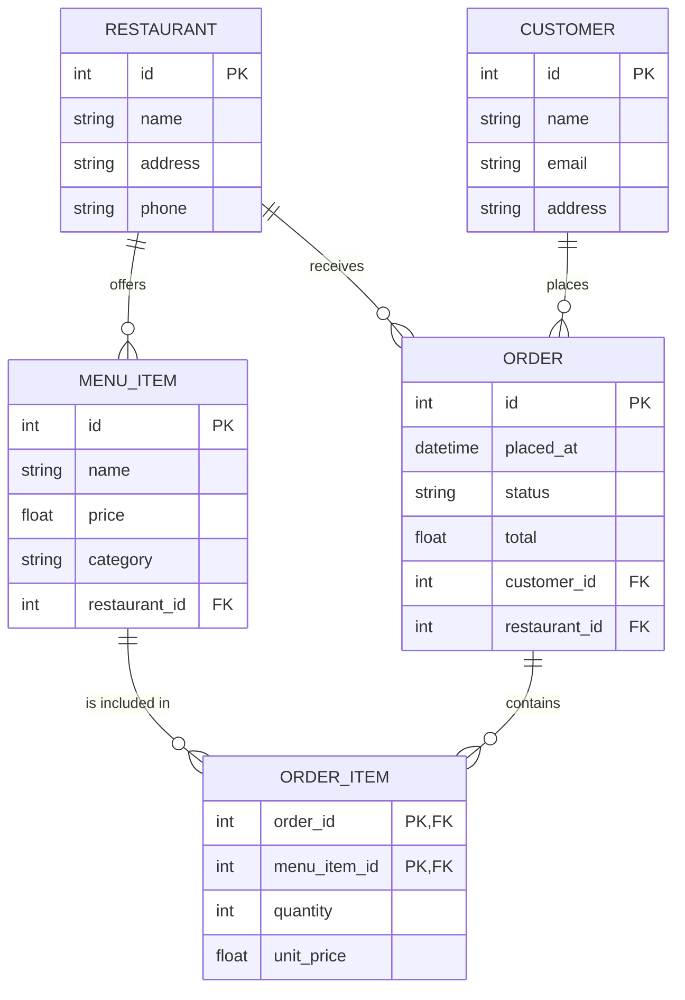

# Ejercicio Salvaje

Básese en este modelo



Y encuentre los bugs de estas clases. Son 6 en total

```java
@Entity
@Table(name = "restaurants")
class Restaurant {
    @Id
    Long id;
    @Column
    String name;
    @Column
    String address;
    @Column
    String phone;
    @ManyToOne(mappedBy = "restaurant")  
    List<MenuItem> menuItems;
    @OneToMany(mappedBy = "restaurant")
    List<Order> orders;
}

@Entity
@Table(name = "menu_items")
class MenuItem {
    @Id
    Long id;
    @Column
    String name;
    @Column
    Float price;
    @Column
    String category;
    @ManyToOne
    @JoinColumn(name = "restaurant_id")
    Restaurant restaurant;
    @OneToMany(mappedBy = "menuItems")  
    List<OrderItem> orderItems;
}

@Entity
@Table(name = "customers")
class Customer {
    @Id
    Long id;
    @Column
    String name;
    @Column
    String email;
    @Column
    String address;
    @OneToMany(mappedBy = "customer")
    List<Order> orders;
}

@Entity
@Table(name = "orders")
class Order {
    @Id
    Long id;
    @Column
    LocalDateTime placedAt;
    @Column
    String status;
    @Column
    Float total;
    @OneToMany                           
    @JoinColumn(name = "customer_id")
    Customer customer;
    @ManyToOne
    @JoinColumn(name = "restaurant_id")
    Restaurant restaurant;
    @OneToMany(mappedBy = "orders")      
    List<OrderItem> orderItems;
}

@Embeddable
class OrderItemId {
    @Column(name = "order_id")
    Long orderId;
    @Column(name = "menu_item_id")
    Long menuItemId;
}

@Entity
@Table(name = "order_items")
class OrderItem {
    @Id                                  
    OrderItemId id;
    @Column
    Integer quantity;
    @Column
    Float unitPrice;
    @ManyToOne
    @MapsId("orderId")
    @JoinColumn(name = "order_id")
    Order order;
    @ManyToOne
    @MapsId("menuItemId")
    @JoinColumn(name = "menu_item_id")
    MenuItem menuItem;
}
```
