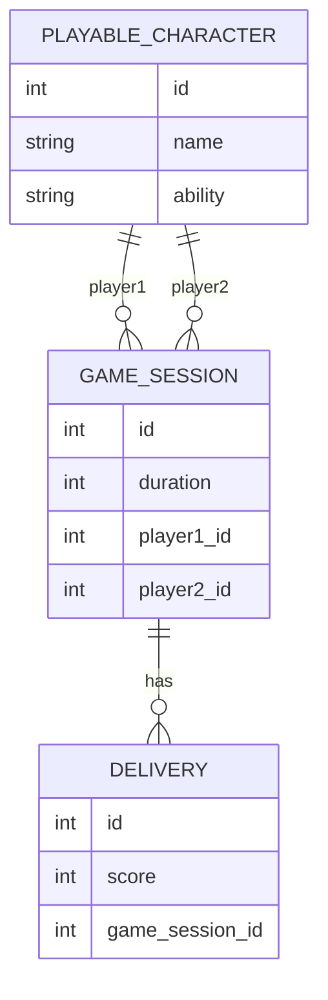

# Ejercicio 2



```java
import jakarta.persistence.*;
import java.util.List;

@Entity
@Table(name = "playable_characters")
public class PlayableCharacter {

    @Id
    @GeneratedValue(strategy = GenerationType.IDENTITY)
    private Long id;

    private String name;

    private String ability;

    @OneToMany(mappedBy = "player1")
    private List<GameSession> sessionsAsPlayer1;

    @OneToMany(mappedBy = "player2")
    private List<GameSession> sessionsAsPlayer2;
}

@Entity
@Table(name = "game_sessions")
public class GameSession {

    @Id
    @GeneratedValue(strategy = GenerationType.IDENTITY)
    private Long id;

    private Integer duration;

    @ManyToOne
    @JoinColumn(name = "player1_id")
    private PlayableCharacter player1;

    @ManyToOne
    @JoinColumn(name = "player2_id")
    private PlayableCharacter player2;

    @OneToMany(mappedBy = "gameSession")
    private List<Delivery> deliveries;
}

@Entity
@Table(name = "deliveries")
public class Delivery {

    @Id
    @GeneratedValue(strategy = GenerationType.IDENTITY)
    private Long id;

    private Integer score;

    @ManyToOne
    @JoinColumn(name = "game_session_id")
    private GameSession gameSession;
}
```

## Consultas

- Devolver la lista de partidas en las que el jugador que actúa como player1 tiene un nombre específico dado como parámetro.
- Listar las partidas que contienen al menos una entrega cuyo puntaje sea mayor a un valor dado.
- Obtener la lista de partidas en las que el jugador en el rol de player1 tenga un nombre específico o exista al menos una entrega asociada a la partida con un puntaje superior a un valor dado
- Obtener la lista de partidas en las que el jugador en el rol de player1 tenga un nombre específico y además exista al menos una entrega asociada a la partida con un puntaje superior a un valor dado.
