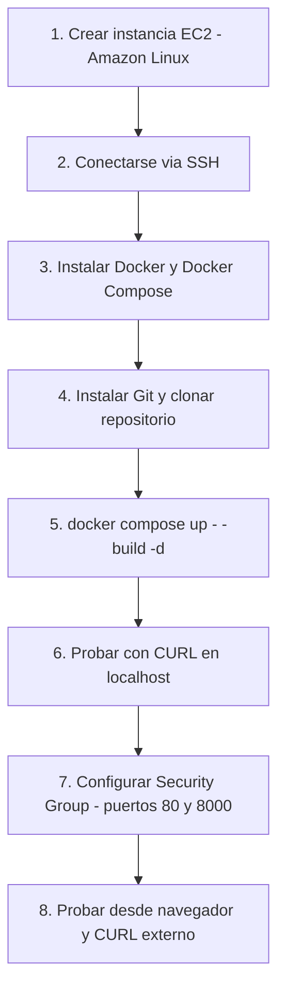

# Fullstack APP AWS Deploy

Nivel: Principiante · Tiempo estimado: 60 - 90 minutos

Objetivo: Desplegar una aplicacion con tres contenedores (NGINX, FastAPI y PostgreSQL) en una instancia EC2 de Amazon Linux usando Docker Compose.

## Arquitectura de la aplicacion

La aplicacion tiene tres componentes que corren como contenedores independientes:

- NGINX: Servidor web que sirve la pagina estatica y actua como proxy reverso.
- FastAPI (Python): Backend de la aplicacion con la API REST.
- PostgreSQL: Base de datos relacional.

El archivo `docker-compose.yml` define como se conectan estos tres servicios entre si.

## Requisitos previos

Antes de comenzar necesitas tener lo siguiente:

- Una cuenta activa en AWS.
- Acceso a la consola de AWS (AWS Management Console).
- Un par de claves SSH creado en la region donde vas a trabajar (o lo crearemos en el paso 1).
- El repositorio de la aplicacion disponible en GitHub o GitLab con el `docker-compose.yml` incluido.

## Paso 1: Crear la instancia EC2

En el buscador de servicios de la consola de AWS escribe EC2 y seleccionalo. En el panel izquierdo haz clic en Instances y luego en el boton Launch instances.

Completa los siguientes campos:

Name and tags: Dale un nombre descriptivo a tu instancia, por ejemplo: `mi-app-docker`.

Application and OS Images (AMI): Selecciona Amazon Linux 2023 AMI (o Amazon Linux 2, ambas son validas). Asegurate de que diga `Free tier eligible` si estas usando la capa gratuita.

Instance type: Selecciona `t2.micro` o `t3.micro` (elegibles para la capa gratuita).

Key pair (login): Si ya tienes un par de claves, seleccionalo del desplegable. Si no tienes uno, haz clic en Create new key pair:

- Nombre: mi-clave-ec2
- Tipo: RSA
- Formato: .pem (para Linux/Mac) o .ppk (para PuTTY en Windows)
- Haz clic en Create key pair y guarda el archivo en un lugar seguro.

Network settings: Deja la VPC y la subred por defecto. En Firewall (security groups) selecciona Create security group. Asegurate de que la regla SSH (puerto 22) este habilitada con source My IP (recomendado por seguridad).

Configure storage: Deja el disco por defecto (8 GB es suficiente para esta practica).

Haz clic en Launch instance. Espera entre 1 y 2 minutos hasta que el estado sea `Running` y la verificacion de estado muestre `2/2 checks passed`.

## Paso 2: Conectarse a la instancia via SSH

En Linux o macOS abre una terminal y ejecuta:

```sh
chmod 400 /ruta/a/tu/mi-clave-ec2.pem

ssh -i EC2Tuto.pem ec2-user@<IP_PUBLICA_DE_TU_INSTANCIA>
```

Reemplaza `<IP_PUBLICA_DE_TU_INSTANCIA>` con la IP publica que aparece en la consola de EC2 (columna Public IPv4 address).

En Windows con PowerShell:

```powershell
ssh -i C:\ruta\a\mi-clave-ec2.pem ec2-user@<IP_PUBLICA_DE_TU_INSTANCIA>
```

Si es la primera vez que te conectas, el sistema te pedira confirmar la autenticidad del host. Escribe `yes` y presiona Enter. Cuando veas el prompt `[ec2-user@ip-xxx ~]$` la conexion fue exitosa.

## Paso 3: Instalar Docker y Docker Compose

Actualizar los paquetes del sistema:

```sh
sudo dnf update -y
```

En Amazon Linux 2 usa `sudo yum update -y` en lugar de `dnf`.

Instalar Docker:

```sh
sudo dnf install -y docker
```

Iniciar el servicio de Docker y habilitarlo para que arranque automaticamente:

```sh
sudo systemctl start docker
sudo systemctl enable docker
```

Agregar el usuario actual al grupo docker (permite ejecutar Docker sin `sudo`):

```sh
sudo usermod -aG docker ec2-user
```

Despues de ejecutar este comando, cierra la sesion SSH y vuelve a conectarte para que el cambio de grupo tenga efecto:

```sh
exit
```

Vuelve a conectarte con el mismo comando SSH del paso 2. Luego verifica que Docker funciona:

```sh
docker --version
docker run hello-world
```

Deberias ver un mensaje que dice `Hello from Docker!`.

Verificar si Docker Compose ya esta disponible:

```sh
docker compose version
```

Si el comando no existe, instalalo manualmente:

```sh
sudo mkdir -p /usr/local/lib/docker/cli-plugins
sudo curl -SL https://github.com/docker/compose/releases/latest/download/docker-compose-linux-x86_64 \
  -o /usr/local/lib/docker/cli-plugins/docker-compose
sudo chmod +x /usr/local/lib/docker/cli-plugins/docker-compose

sudo mkdir -p /usr/libexec/docker/cli-plugins
sudo curl -L https://github.com/docker/buildx/releases/download/v0.25.0/buildx-v0.25.0.linux-amd64 \
  -o /usr/libexec/docker/cli-plugins/docker-buildx
sudo chmod +x /usr/libexec/docker/cli-plugins/docker-buildx
```

Verifica la instalacion:

```sh
sudo systemctl restart docker
docker compose version
docker buildx version
```

## Paso 4: Instalar Git y clonar el repositorio

Instalar Git:

```sh
sudo dnf install -y git
git --version
```

Clonar el repositorio (reemplaza la URL con la de tu repositorio):

```sh
git clone https://github.com/Domiciano/AppDeployWorkshop
cd tu-repositorio
```

Verificar que el archivo `docker-compose.yml` este presente:

```sh
ls -la
cat docker-compose.yml
```

Un ejemplo de como deberia verse el `docker-compose.yml`:

```yaml
version: "3.9"

services:
  db:
    image: postgres:15
    environment:
      POSTGRES_USER: usuario
      POSTGRES_PASSWORD: contrasena
      POSTGRES_DB: mi_base_datos
    ports:
      - "5432:5432"
    volumes:
      - postgres_data:/var/lib/postgresql/data

  api:
    build: ./api
    ports:
      - "8000:8000"
    environment:
      DATABASE_URL: postgresql://usuario:contrasena@db:5432/mi_base_datos
    depends_on:
      - db

  web:
    image: nginx:alpine
    ports:
      - "80:80"
    volumes:
      - ./nginx/nginx.conf:/etc/nginx/nginx.conf
      - ./web:/usr/share/nginx/html
    depends_on:
      - api

volumes:
  postgres_data:
```

## Paso 5: Levantar la aplicacion con Docker Compose

Construir y levantar los contenedores:

```sh
docker compose up --build -d
```

`--build` reconstruye las imagenes si hay cambios en el codigo. `-d` corre los contenedores en segundo plano (modo detached). Este proceso puede tardar varios minutos la primera vez.

Verificar que los contenedores esten corriendo:

```sh
docker compose ps
```

Deberias ver los tres servicios (`db`, `api`, `web`) con estado `Up` o `running`.

Si algo no funciona, revisa los logs:

```sh
docker compose logs
docker compose logs api
docker compose logs -f api
```

## Paso 6: Probar la aplicacion con CURL

Desde dentro de la instancia EC2 puedes hacer pruebas locales.

Probar NGINX:

```sh
curl http://localhost:80
```

Probar la API de FastAPI:

```sh
curl http://localhost:8000/
curl http://localhost:8000/docs
curl http://localhost:8000/items
curl -X POST http://localhost:8000/items \
  -H "Content-Type: application/json" \
  -d '{"nombre": "producto1", "precio": 100}'
```

Verificar la conexion con PostgreSQL:

```sh
docker compose exec db psql -U usuario -d mi_base_datos -c "\dt"
```

## Paso 7: Configurar las reglas de seguridad (Security Group)

Hasta este momento la aplicacion funciona internamente en la instancia, pero no es accesible desde internet. Para eso necesitas abrir los puertos en el Security Group de EC2.

En la consola de EC2, selecciona tu instancia. En la pestana Security haz clic en el enlace del Security Group. Selecciona la pestana Inbound rules y haz clic en Edit inbound rules.

Agrega las siguientes reglas:

- HTTP · TCP · Puerto 80 · Source 0.0.0.0/0 → Trafico web (NGINX)
- Custom TCP · TCP · Puerto 8000 · Source 0.0.0.0/0 → API FastAPI
- Custom TCP · TCP · Puerto 5432 · Source 0.0.0.0/0 → PostgreSQL (solo si se necesita acceso externo)

Nota de seguridad: Abrir el puerto 5432 al publico general no es recomendable en produccion. Para esta practica lo habilitamos para pruebas, pero en un entorno real debes restringir ese acceso.

Haz clic en Save rules.

## Paso 8: Probar desde el navegador

Obtén la IP publica de tu instancia desde la consola de EC2 (columna Public IPv4 address) y abre estas URLs:

```plain
http://<IP_PUBLICA>/           -> Pagina web servida por NGINX
http://<IP_PUBLICA>:8000/      -> Raiz de la API FastAPI
http://<IP_PUBLICA>:8000/docs  -> Documentacion interactiva de FastAPI
```

Desde tu maquina local con CURL:

```sh
curl http://<IP_PUBLICA>/
curl http://<IP_PUBLICA>:8000/
curl http://<IP_PUBLICA>:8000/items
```

## Comandos utiles para la administracion

```sh
# Ver el estado de los contenedores
docker compose ps

# Detener los contenedores (sin eliminarlos)
docker compose stop

# Volver a iniciar los contenedores detenidos
docker compose start

# Detener y eliminar contenedores (datos en volumen se conservan)
docker compose down

# Detener, eliminar contenedores Y eliminar volumenes (se pierden los datos)
docker compose down -v

# Reconstruir e iniciar despues de cambios en el codigo
docker compose up --build -d

# Entrar al shell de un contenedor especifico
docker compose exec api bash
docker compose exec db bash

# Ver el uso de recursos de los contenedores
docker stats
```

## Solucion de problemas comunes

El comando `docker` dice "permission denied": El usuario no esta en el grupo `docker`. Ejecuta `sudo usermod -aG docker ec2-user`, cierra la sesion y vuelve a conectarte.

Un contenedor aparece como `Exit` en `docker compose ps`: Revisa sus logs con `docker compose logs <nombre_servicio>` para ver el error especifico.

La pagina no carga desde el navegador pero si desde dentro de la instancia: Verifica que las reglas del Security Group esten bien configuradas con los puertos correctos y source `0.0.0.0/0`.

Error de conexion a la base de datos desde la API: Revisa la variable `DATABASE_URL` en el `docker-compose.yml`. El hostname debe ser el nombre del servicio definido en el compose (por ejemplo `db`), no `localhost`.

No hay espacio en disco: Ejecuta `docker system prune -a` para eliminar imagenes y contenedores sin uso. Verifica el espacio con `df -h`.

## Resumen del flujo completo


