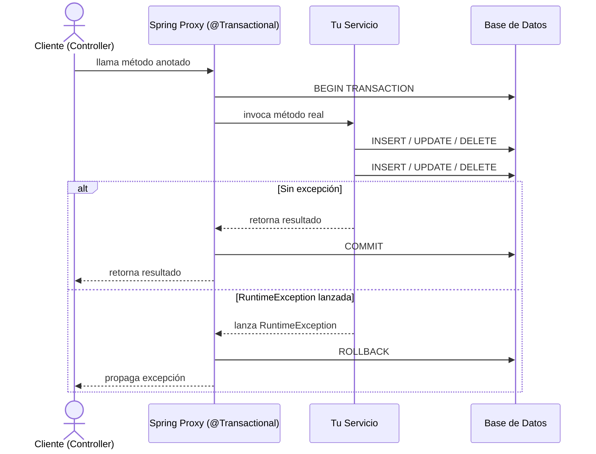

# Transacciones en Spring Boot

## ¿Qué es una Transacción?

En el mundo de las bases de datos, una transacción es una secuencia de una o más operaciones que se ejecutan como una única unidad de trabajo. O todas las operaciones se completan con éxito, o ninguna de ellas se aplica. Esto garantiza la integridad y consistencia de los datos.

Las transacciones se rigen por los principios ACID:

`Atomicity`
La transacción es "todo o nada". Si una parte de la transacción falla, toda la transacción falla y la base de datos vuelve al estado en que se encontraba antes de que comenzara la transacción.

`Consistency`
La transacción lleva a la base de datos de un estado válido a otro.

`Isolation`
Las transacciones concurrentes se ejecutan de forma aislada unas de otras. Los resultados de una transacción no son visibles para otras hasta que se completa.

`Durability`
Una vez que una transacción se ha completado con éxito (commit), sus cambios son permanentes y sobreviven a cualquier fallo del sistema.

## La Magia de @Transactional

Spring Boot simplifica enormemente la gestión de transacciones con la anotación `@Transactional`. Cuando anotas un método con `@Transactional`, Spring lo envuelve en un proxy que se encarga de iniciar, confirmar (commit) o revertir (rollback) la transacción por ti.

Un proxy es como un intermediario: en lugar de llamar directamente a tu método, se llama primero a un objeto "envoltorio" que decide qué hacer antes y después de ejecutar el método real.

Por defecto, Spring hace commit si el método termina sin excepción, y rollback automático si lanza una `RuntimeException` o un `Error`.

## Ciclo de una Transacción



En Hibernate (o JPA), un objeto puede estar en cuatro estados principales: `transient`, `managed` (persistent), `detached` y `removed`. 

Un objeto transient es uno que acabas de crear con new y todavía no está asociado al contexto de persistencia, por lo que Hibernate no lo conoce ni lo puede sincronizar con la base de datos; si intentas relacionarlo con otra entidad gestionada puede producir errores si no se persiste primero o no hay cascade. 

Un objeto `managed`/`persistent` es aquel que está dentro del contexto de persistencia activo (por ejemplo dentro de una transacción con `@Transactional`), por lo que Hibernate lo monitorea y cualquier cambio se sincroniza automáticamente con la base de datos. 

Un objeto `detached` es una entidad que fue gestionada pero ya no lo está (por ejemplo cuando termina la transacción o se cierra la sesión); el objeto sigue existiendo pero Hibernate ya no rastrea sus cambios. 

Finalmente, un objeto `removed` es una entidad marcada para eliminación y será borrada en el flush o al finalizar la transacción. El problema con FetchType.LAZY es diferente: la entidad sí está gestionada, pero sus relaciones se cargan mediante proxies, por lo que si intentas acceder a ellas fuera de la sesión o transacción se produce un LazyInitializationException.

## Entidades del Proyecto Base

Usaremos las entidades del proyecto: `Student`, `Course` y `Enrollment` (tabla `student_course` con clave compuesta). La operación de matrícula es un caso perfecto para ilustrar transacciones: debe crear un registro en `student_course` vinculando un estudiante y un curso existentes. Si algo falla a mitad del proceso, nada debe quedar a medias.

## Caso Exitoso: Matricular un Estudiante

El servicio busca el estudiante y el curso, crea el `Enrollment` y lo persiste. Si ambos existen y no hay errores, la transacción hace commit y el registro queda en la base de datos.

```java
@Service
public class EnrollmentService {

    @Autowired
    private StudentRepository studentRepository;

    @Autowired
    private CourseRepository courseRepository;

    @Autowired
    private EnrollmentRepository enrollmentRepository;

    @Transactional
    public void enroll(Integer studentId, Integer courseId) {
        Student student = studentRepository.findById(studentId)
                .orElseThrow(() -> new RuntimeException("Estudiante no encontrado"));

        Course course = courseRepository.findById(courseId)
                .orElseThrow(() -> new RuntimeException("Curso no encontrado"));

        StudentCourseId key = new StudentCourseId(studentId, courseId);
        Enrollment enrollment = new Enrollment();
        enrollment.setId(key);
        enrollment.setStudent(student);
        enrollment.setCourse(course);

        enrollmentRepository.save(enrollment);
        // Si llegamos aquí sin excepción → COMMIT automático
    }
}
```

## Simulación de Fallo: Rollback en Acción

Ahora simulamos que algo explota después de guardar la matrícula. Spring detecta la `RuntimeException` y hace rollback: el `Enrollment` guardado en el `save()` se deshace y la base de datos queda igual que antes de entrar al método.

```java
@Transactional
public void enrollWithFailure(Integer studentId, Integer courseId) {
    Student student = studentRepository.findById(studentId)
            .orElseThrow(() -> new RuntimeException("Estudiante no encontrado"));

    Course course = courseRepository.findById(courseId)
            .orElseThrow(() -> new RuntimeException("Curso no encontrado"));

    StudentCourseId key = new StudentCourseId(studentId, courseId);
    Enrollment enrollment = new Enrollment();
    enrollment.setId(key);
    enrollment.setStudent(student);
    enrollment.setCourse(course);

    enrollmentRepository.save(enrollment);

    // Simulamos un fallo inesperado después del save
    throw new RuntimeException("Fallo catastrófico del sistema de matrículas");

    // NUNCA se llega aquí → el save() anterior se revierte (ROLLBACK)
}
```

Aunque `save()` se ejecutó, el registro no quedará en la base de datos porque Spring intercepta la excepción y llama a `ROLLBACK` antes de devolver el control al cliente.

## El Error Transient

El error `TransientPropertyValueException` ocurre cuando intentas guardar una entidad que referencia a otra entidad en estado *transient*, es decir, un objeto que aún no tiene ID porque nunca fue persistido.

```java
@Transactional
public void createCourseWithNewProfessor(String courseName) {
    // Este Professor NO viene de la base de datos, fue creado en memoria
    Professor newProfessor = new Professor();
    newProfessor.setName("Profesor Sin Guardar");

    Course course = new Course();
    course.setName(courseName);
    course.setCredits(3);
    course.setProfessor(newProfessor); // ← referencia a objeto transient

    // ERROR: object references an unsaved transient instance
    // Hibernate no sabe qué ID poner en el FK professor_id
    courseRepository.save(course);
}
```

La solución es guardar primero el `Professor` antes de asignarlo, o usar `cascade = CascadeType.PERSIST` en la relación.

```java
@Transactional
public void createCourseWithNewProfessorFixed(String courseName) {
    Professor newProfessor = new Professor();
    newProfessor.setName("Profesor Sin Guardar");
    professorRepository.save(newProfessor); // ← ahora tiene ID

    Course course = new Course();
    course.setName(courseName);
    course.setCredits(3);
    course.setProfessor(newProfessor); // ← ya no es transient

    courseRepository.save(course); // funciona
}
```

## RestController para Probar Todo

Exponemos los tres casos como endpoints HTTP. Los IDs están quemados en código para simplificar: el estudiante 1 y el curso 2 ya existen en el `data.sql` del proyecto.

```java
@RestController
public class EnrollmentController {

    @Autowired
    private EnrollmentService enrollmentService;

    // GET /enroll  → caso exitoso
    @GetMapping("/enroll")
    public Map<String, String> enroll() {
        enrollmentService.enroll(1, 2);
        return Map.of("resultado", "Matrícula exitosa");
    }

    // GET /enroll-fail  → rollback
    @GetMapping("/enroll-fail")
    public Map<String, String> enrollFail() {
        try {
            enrollmentService.enrollWithFailure(1, 2);
        } catch (RuntimeException e) {
            return Map.of("error", e.getMessage(), "rollback", "aplicado");
        }
        return Map.of("resultado", "sin error");
    }

    // GET /transient-error  → TransientPropertyValueException
    @GetMapping("/transient-error")
    public Map<String, String> transientError() {
        try {
            enrollmentService.createCourseWithNewProfessor("Curso Problemático");
        } catch (Exception e) {
            return Map.of("error", e.getMessage());
        }
        return Map.of("resultado", "sin error");
    }
}
```

Para verificar que el rollback funcionó correctamente, accede a la consola H2 en `http://localhost:8080/h2` y revisa que la tabla `student_course` no tenga el registro que intentabas crear con `/enroll-fail`.

## ¿Por qué los Selects también usan @Transactional?

Es común ver métodos de solo lectura anotados con `@Transactional`. Hay dos razones concretas para esto.

La primera es evitar el `LazyInitializationException`. Cuando una colección está marcada como `FetchType.LAZY` (el default en `@OneToMany`), Hibernate no la carga hasta que la accedes. Pero para cargarla necesita una sesión activa.

La segunda razón es la optimización con `readOnly = true`. Cuando marcas una transacción como de solo lectura, Hibernate omite el *dirty checking* al final: no necesita comparar el estado original de cada objeto con su estado actual para saber si algo cambió. En métodos que cargan muchos objetos, esto reduce el trabajo considerablemente.

```java
@Transactional(readOnly = true)
public List<Student> getAllStudents() {
    return studentRepository.findAll();
    // Hibernate NO hará dirty checking al cerrar la transacción
    // Solo lectura: más rápido, sin riesgo de writes accidentales
}
```

La convención recomendada es anotar la clase de servicio completa con `@Transactional(readOnly = true)` y sobreescribir con `@Transactional` solo los métodos que modifican datos.

```java
@Service
@Transactional(readOnly = true) // default para todos los métodos
public class StudentService {

    public List<Student> getAll() { ... }          // readOnly = true
    public Student getById(Integer id) { ... }     // readOnly = true

    @Transactional // sobreescribe: readOnly = false
    public void create(Student student) { ... }

    @Transactional // sobreescribe: readOnly = false
    public void delete(Integer id) { ... }
}
```
