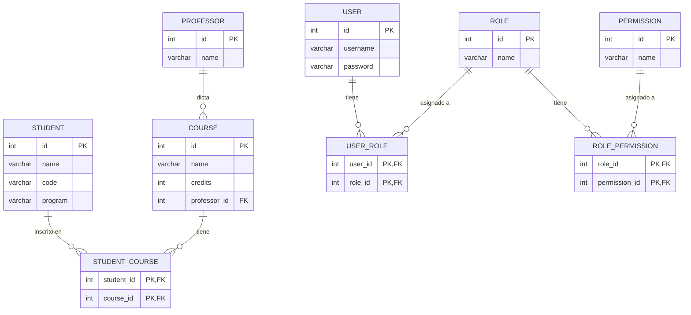

# Query Methods en Spring Data JPA

[Spring Data JPA — Query Methods](https://docs.spring.io/spring-data/jpa/reference/jpa/query-methods.html)

## ¿Qué son los Query Methods?

Spring Data JPA ofrece una funcionalidad llamada **Query Methods**. Permite crear consultas a la base de datos de forma automática simplemente declarando métodos en las interfaces de repositorio.

Spring analiza el nombre del método, lo divide en partes y lo traduce a JPQL automáticamente. La convención sigue el formato `findBy...`, `countBy...`, `existsBy...`, seguido de las propiedades de la entidad y los operadores `And`, `Or`, `GreaterThan`, `Containing`, etc.

## Preparando el Modelo

El modelo completo tiene 9 tablas. Las tres primeras entidades son académicas: `Professor`, `Course` y `Student`. Las otras tres son de seguridad: `User`, `Role` y `Permission`. Cada relación muchos a muchos se modela con una entidad intermedia y clave embebida (`StudentCourse`, `UserRole`, `RolePermission`).



## Repo base

[Repositorio listo para continuar](https://github.com/Domiciano/QueryMethodsTareaTemplate)

## Ejemplos Básicos

Estos métodos se declaran en las interfaces de repositorio. Spring genera la implementación en tiempo de ejecución.

```java
public interface CourseRepository extends JpaRepository<Course, Integer> {

    // Cursos con un nombre exacto
    List<Course> findByName(String name);

    // Cursos cuyo nombre contenga una cadena (case-insensitive)
    List<Course> findByNameContainingIgnoreCase(String keyword);

    // Cursos con más créditos que el valor dado
    List<Course> findByCreditsGreaterThan(int credits);

    // Cursos con exactamente N créditos, ordenados por nombre
    List<Course> findByCreditOrderByNameAsc(int credits);
}
```

```java
public interface StudentRepository extends JpaRepository<Student, Integer> {

    // Estudiante por código único
    Optional<Student> findByCode(String code);

    // Estudiantes de un programa académico
    List<Student> findByProgram(String program);

    // Estudiantes cuyo nombre contenga una cadena
    List<Student> findByNameContainingIgnoreCase(String name);
}
```

## Consultas en varias tablas

Spring Data JPA permite navegar por las relaciones entre entidades usando el carácter `_` (guión bajo) como separador en el nombre del método. Cada segmento es el nombre del campo en la clase Java (no la columna de la base de datos).

La estructura es: `findBy` + `NombreDeCampo` + `_` + `PropiedadAnidada`.

Ejemplo: para buscar cursos por el nombre del profesor, se navega desde `Course` → campo `professor` → campo `name`:

```java
// En CourseRepository — navega Course → professor → name
List<Course> findByProfessorName(String professorName);

// En CourseRepository — navega Course → professor → name, cuenta
long countByProfessorName(String professorName);
```

Para relaciones más profundas que cruzan la tabla intermedia, se usa `_` explícito. Desde `Student` → `studentCourses` (lista de `StudentCourse`) → `course` → `name`:

```java
// En StudentRepository
// Navega: Student → studentCourses → course → name
List<Student> findByStudentCourses_Course_Name(String courseName);

// Navega: Student → studentCourses → course → professor → name
List<Student> findByStudentCourses_Course_ProfessorName(String professorName);
```

Desde `Professor` en dirección inversa:

```java
// En ProfessorRepository
// Navega: Professor → courses → studentCourses → student → program
List<Professor> findDistinctByCourses_StudentCourses_Student_Program(String program);
```

El `_` fuerza a Spring a tratar el segmento como un salto de relación y no como parte de un nombre de campo compuesto (por ejemplo, `studentCourses` vs `student_Courses`). Sin `_`, Spring intenta resolver `studentCoursesCourse` como un único nombre de propiedad y falla.

## Datos de prueba

```sql
-- Profesores
INSERT INTO professor (name) VALUES ('Juan Perez');
INSERT INTO professor (name) VALUES ('Maria Rodriguez');
INSERT INTO professor (name) VALUES ('Carlos Gomez');

-- Cursos
INSERT INTO course (name, credits, professor_id) VALUES ('Introduccion a la Programacion', 4, 1);
INSERT INTO course (name, credits, professor_id) VALUES ('Estructuras de Datos', 4, 1);
INSERT INTO course (name, credits, professor_id) VALUES ('Anatomia Humana', 5, 2);
INSERT INTO course (name, credits, professor_id) VALUES ('Fisiologia', 5, 2);
INSERT INTO course (name, credits, professor_id) VALUES ('Derecho Penal', 3, 3);
INSERT INTO course (name, credits, professor_id) VALUES ('Historia del Arte', 3, 3);

-- Estudiantes
INSERT INTO student (name, code, program) VALUES ('Laura Garcia', '2021102001', 'Ingenieria de Sistemas');
INSERT INTO student (name, code, program) VALUES ('Pedro Pascal', '2021102002', 'Ingenieria de Sistemas');
INSERT INTO student (name, code, program) VALUES ('Andres Lopez', '2021102003', 'Medicina');
INSERT INTO student (name, code, program) VALUES ('Sofia Torres', '2021102004', 'Derecho');
INSERT INTO student (name, code, program) VALUES ('Camila Velez', '2021102005', 'Medicina');

-- Inscripciones (student_course)
INSERT INTO student_course (student_id, course_id) VALUES (1, 1);  -- Laura en Intro Prog
INSERT INTO student_course (student_id, course_id) VALUES (1, 2);  -- Laura en Estructuras
INSERT INTO student_course (student_id, course_id) VALUES (2, 1);  -- Pedro en Intro Prog
INSERT INTO student_course (student_id, course_id) VALUES (3, 3);  -- Andres en Anatomia
INSERT INTO student_course (student_id, course_id) VALUES (3, 4);  -- Andres en Fisiologia
INSERT INTO student_course (student_id, course_id) VALUES (4, 5);  -- Sofia en Derecho Penal
INSERT INTO student_course (student_id, course_id) VALUES (4, 6);  -- Sofia en Historia del Arte
INSERT INTO student_course (student_id, course_id) VALUES (5, 3);  -- Camila en Anatomia
```

```sql
-- ─── PERMISOS: 4 operaciones × 4 tablas = 16 permisos ───────────────────────
INSERT INTO permission (name) VALUES ('CREATE_STUDENT');    -- 1
INSERT INTO permission (name) VALUES ('READ_STUDENT');      -- 2
INSERT INTO permission (name) VALUES ('UPDATE_STUDENT');    -- 3
INSERT INTO permission (name) VALUES ('DELETE_STUDENT');    -- 4
INSERT INTO permission (name) VALUES ('CREATE_PROFESSOR');  -- 5
INSERT INTO permission (name) VALUES ('READ_PROFESSOR');    -- 6
INSERT INTO permission (name) VALUES ('UPDATE_PROFESSOR');  -- 7
INSERT INTO permission (name) VALUES ('DELETE_PROFESSOR');  -- 8
INSERT INTO permission (name) VALUES ('CREATE_ENROLLMENT'); -- 9
INSERT INTO permission (name) VALUES ('READ_ENROLLMENT');   -- 10
INSERT INTO permission (name) VALUES ('UPDATE_ENROLLMENT'); -- 11
INSERT INTO permission (name) VALUES ('DELETE_ENROLLMENT'); -- 12
INSERT INTO permission (name) VALUES ('CREATE_COURSE');     -- 13
INSERT INTO permission (name) VALUES ('READ_COURSE');       -- 14
INSERT INTO permission (name) VALUES ('UPDATE_COURSE');     -- 15
INSERT INTO permission (name) VALUES ('DELETE_COURSE');     -- 16

-- ─── ROLES ───────────────────────────────────────────────────────────────────
INSERT INTO role (name) VALUES ('ADMIN');    -- 1
INSERT INTO role (name) VALUES ('DIRECTOR'); -- 2

-- ─── ADMIN: todos los permisos (1 – 16) ──────────────────────────────────────
INSERT INTO role_permission (role_id, permission_id) VALUES (1, 1);
INSERT INTO role_permission (role_id, permission_id) VALUES (1, 2);
INSERT INTO role_permission (role_id, permission_id) VALUES (1, 3);
INSERT INTO role_permission (role_id, permission_id) VALUES (1, 4);
INSERT INTO role_permission (role_id, permission_id) VALUES (1, 5);
INSERT INTO role_permission (role_id, permission_id) VALUES (1, 6);
INSERT INTO role_permission (role_id, permission_id) VALUES (1, 7);
INSERT INTO role_permission (role_id, permission_id) VALUES (1, 8);
INSERT INTO role_permission (role_id, permission_id) VALUES (1, 9);
INSERT INTO role_permission (role_id, permission_id) VALUES (1, 10);
INSERT INTO role_permission (role_id, permission_id) VALUES (1, 11);
INSERT INTO role_permission (role_id, permission_id) VALUES (1, 12);
INSERT INTO role_permission (role_id, permission_id) VALUES (1, 13);
INSERT INTO role_permission (role_id, permission_id) VALUES (1, 14);
INSERT INTO role_permission (role_id, permission_id) VALUES (1, 15);
INSERT INTO role_permission (role_id, permission_id) VALUES (1, 16);

-- ─── DIRECTOR: leer todo + CRUD completo de Enrollment ───────────────────────
--   READ de todas las tablas
INSERT INTO role_permission (role_id, permission_id) VALUES (2, 2);  -- READ_STUDENT
INSERT INTO role_permission (role_id, permission_id) VALUES (2, 6);  -- READ_PROFESSOR
INSERT INTO role_permission (role_id, permission_id) VALUES (2, 14); -- READ_COURSE
--   CRUD completo de Enrollment
INSERT INTO role_permission (role_id, permission_id) VALUES (2, 9);  -- CREATE_ENROLLMENT
INSERT INTO role_permission (role_id, permission_id) VALUES (2, 10); -- READ_ENROLLMENT
INSERT INTO role_permission (role_id, permission_id) VALUES (2, 11); -- UPDATE_ENROLLMENT
INSERT INTO role_permission (role_id, permission_id) VALUES (2, 12); -- DELETE_ENROLLMENT

-- ─── USUARIOS (contraseña en texto plano solo para pruebas) ──────────────────
INSERT INTO app_user (username, password) VALUES ('carlos',  '{noop}admin123');    -- 1
INSERT INTO app_user (username, password) VALUES ('maria',   '{noop}admin123');    -- 2
INSERT INTO app_user (username, password) VALUES ('ana',     '{noop}dir123');      -- 3
INSERT INTO app_user (username, password) VALUES ('juan',    '{noop}dir123');      -- 4
INSERT INTO app_user (username, password) VALUES ('sofia',   '{noop}dir123');      -- 5

-- ─── ASIGNACIÓN DE ROLES ─────────────────────────────────────────────────────
INSERT INTO user_role (user_id, role_id) VALUES (1, 1); -- carlos  → ADMIN
INSERT INTO user_role (user_id, role_id) VALUES (2, 1); -- maria   → ADMIN
INSERT INTO user_role (user_id, role_id) VALUES (3, 2); -- ana     → DIRECTOR
INSERT INTO user_role (user_id, role_id) VALUES (4, 2); -- juan    → DIRECTOR
INSERT INTO user_role (user_id, role_id) VALUES (5, 2); -- sofia   → DIRECTOR
```

Habilita esta propiedad para ver la operación SQL subyacente que genera cada query method:

```ini
spring.jpa.show-sql=true
spring.jpa.properties.hibernate.format_sql=true
```
