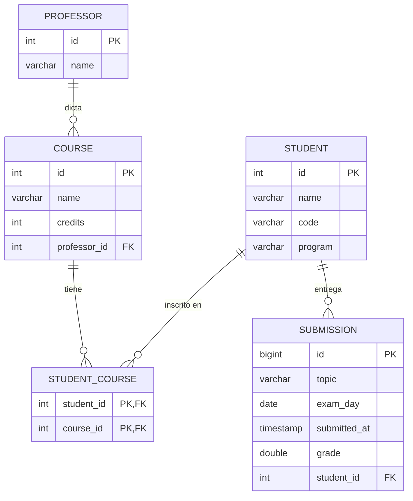

# Manejo de Fechas

## Introducción

En esta lección extendemos el modelo académico ya construido (Professor → Course → StudentCourse → Student) añadiendo la entidad `Submission`. Un estudiante puede tener muchas entregas; cada entrega registra el tema del trabajo, la fecha del examen, la fecha y hora exacta de entrega y la nota obtenida.

Esta extensión nos permite explorar los tipos de fechas modernos de Java (`LocalDate`, `LocalDateTime`) en un contexto real y ver cómo se traducen a columnas SQL (`DATE`, `TIMESTAMP`).

## Diagrama ER actualizado

El modelo ahora incluye `SUBMISSION` con relación muchos-a-uno hacia `STUDENT`.



## Entidad `Submission`

`LocalDate` se usa para `examDay` (solo día) y `LocalDateTime` para `submittedAt` (día + hora exacta). La relación `@ManyToOne` apunta al estudiante dueño de la entrega.

```java
package com.example.myapp.model;

import jakarta.persistence.*;
import java.time.LocalDate;
import java.time.LocalDateTime;

@Entity
@Table(name = "submission")
public class Submission {

    @Id
    @GeneratedValue(strategy = GenerationType.IDENTITY)
    private Long id;

    @Column(nullable = false)
    private String topic;

    // Se mapea a DATE en SQL — solo almacena año, mes y día
    @Column(name = "exam_day", nullable = false)
    private LocalDate examDay;

    // Se mapea a TIMESTAMP en SQL — almacena fecha y hora exacta
    @Column(name = "submitted_at", nullable = false)
    private LocalDateTime submittedAt;

    @Column(nullable = false)
    private Double grade;

    @ManyToOne
    @JoinColumn(name = "student_id", nullable = false)
    private Student student;

    // Getters, setters y constructores
}
```

## Actualizar `Student`

Agrega la lista de submissions en la entidad `Student` para completar la relación bidireccional. El atributo `mappedBy` indica que `Submission` es el lado dueño de la relación (tiene la FK).

```java
@OneToMany(mappedBy = "student")
private List<Submission> submissions;
```

## `SubmissionRepository` Query Methods con fechas

Spring Data JPA genera las consultas automáticamente a partir del nombre del método. Los tipos `LocalDate` y `LocalDateTime` se usan directamente como parámetros.

```java
package com.example.myapp.repository;

import com.example.myapp.model.Submission;
import org.springframework.data.jpa.repository.JpaRepository;
import java.time.LocalDate;
import java.time.LocalDateTime;
import java.util.List;

public interface SubmissionRepository extends JpaRepository<Submission, Long> {

    // Entregas enviadas después de una fecha y hora exacta (LocalDateTime)
    List<Submission> findBySubmittedAtAfter(LocalDateTime dateTime);

    // Entregas cuyo examen fue antes de una fecha (LocalDate)
    List<Submission> findByExamDayBefore(LocalDate date);

    // Entregas cuyo examen cae dentro de un rango de fechas
    List<Submission> findByExamDayBetween(LocalDate start, LocalDate end);

    // Entregas con nota mayor a un valor dado
    List<Submission> findByGradeGreaterThan(Double grade);

    // Nota mayor que X Y examen después de una fecha (condición compuesta)
    List<Submission> findByGradeGreaterThanAndExamDayAfter(Double grade, LocalDate date);

    // Entregas de un estudiante específico, navegando la relación por código
    List<Submission> findByStudent_Code(String studentCode);

    // Entregas de un estudiante cuyo examen aún no ha pasado
    List<Submission> findByStudent_CodeAndExamDayAfter(String studentCode, LocalDate date);
}
```

## Datos no menores

- `LocalDate` de Java se mapea con `DATE` en SQL — almacena solo año, mes y día (ej. `2025-04-10`)
- `LocalDateTime` de Java se mapea con `TIMESTAMP` en SQL — almacena fecha y hora exacta (ej. `2025-04-09 22:15:00`)
- `LocalTime` de Java se mapea con `TIME` en SQL — almacena solo la hora (ej. `22:15:00`)

# Reto

- Verifique si existe al menos una entrega (Submission) para un estudiante con un studentId dado.
- Obtenga si un estudiante específico tiene al menos una entrega aprobada (por ejemplo, grade ≥ 3.0).
- Obtenga la primera entrega registrada en el sistema (la más antigua).
- Obtenga las 5 entregas con mejor calificación.
- Obtenga el Top 5 de mejores calificaciones en un topic específico.
- Obtenga todas las entregas realizadas en un rango de fechas de examen. Por ejemplo entre 2025-03-01 y 2025-03-15.
- Obtenga todas las entregas realizadas después de cierta fecha. Por ejemplo 2025-03-10T18:00.
- Obtenga todas las entregas de un estudiante (por nombre) ordenadas por fecha de envío descendente.
- Obtenga la mejor entrega (mayor nota) de un estudiante específico.
- Obtenga si existe al menos una entrega de estudiantes de un programa específico con nota mayor a 4.5.
- Obtenga las entregas ordenadas por fecha de envío descendente de forma paginada.
- Obtenga los cursos en los que existen entregas realizadas después de cierta fecha. Por ejemplo 2025-03-10T18:00.
- NIVEL DIOS: Obtenga los estudiantes asociados a las 5 entregas con mejor calificación en un topic específico. Que no se repitan los estudiantes

## Creación de objetos

Probablemente necesite saber cómo generar objetos de tipo `LocalDate` y `LocalDateTime`

```java
// Año, mes, día
LocalDate date = LocalDate.of(2025, 3, 10);

// Ahora
LocalDate today = LocalDate.now();

// Desde String
LocalDate date = LocalDate.parse("2025-03-10");


// Año, mes, día, hora, minuto
LocalDateTime dateTime = LocalDateTime.of(2025, 3, 10, 18, 0);

// Ahora
LocalDateTime now = LocalDateTime.now();

// Desde un String
LocalDateTime dateTime = LocalDateTime.parse("2025-03-10T18:00:00");
```

Para una inserción en SQL, debe seguir los formatos

```sql
INSERT INTO submission (topic, exam_day, submitted_at, grade, student_id) VALUES ('Examen Final de Bioquimica', '2025-07-05', '2025-07-05 09:10:00', 2.8, 5);
```
