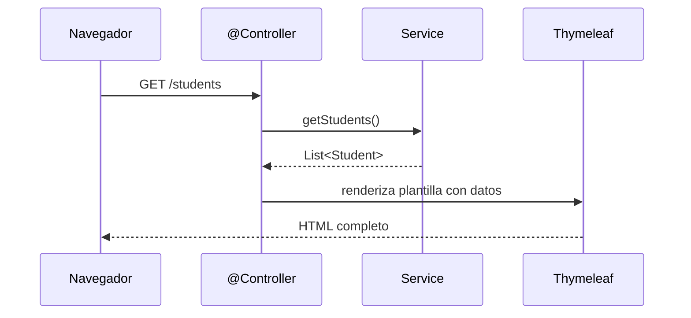
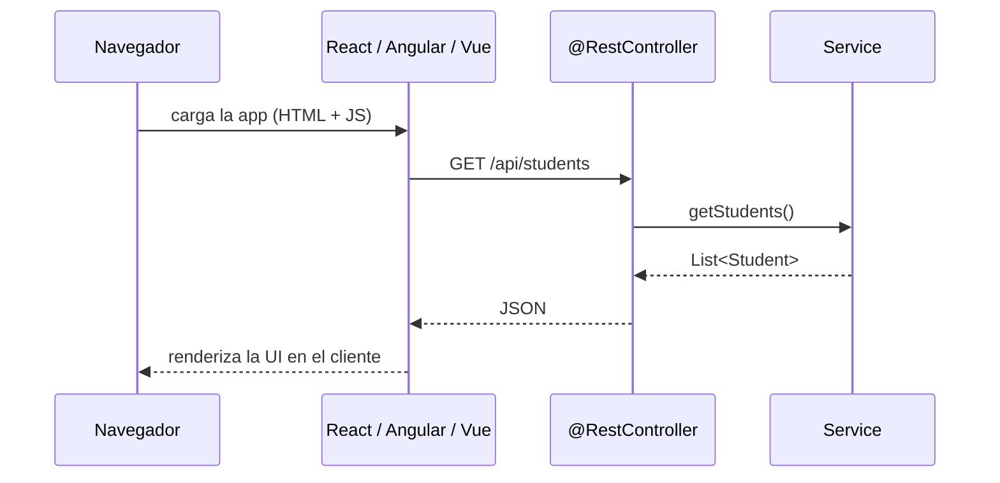

# MVC en Spring Boot

En lecciones anteriores hemos construido nuestras aplicaciones siguiendo una arquitectura de 3 capas bien definida:

`Capa de Repositorio`
Responsable del acceso a los datos. Se comunica directamente con la base de datos. (Ej: `StudentRepository`)

`Capa de Servicio`
Contiene la lógica de negocio principal. Orquesta las operaciones, llama a los repositorios y puede aplicar reglas de negocio complejas. (Ej: `StudentService`)

`Capa de Controlador`
Expone la funcionalidad de la aplicación al mundo exterior, generalmente a través de endpoints HTTP. Recibe las peticiones, las delega a la capa de servicio y devuelve una respuesta.

## ¿Cómo se relacionan MVC y la Arquitectura de 3 Capas?

Es muy común confundir estos dos patrones, pero en realidad se complementan: la arquitectura de 3 capas es una forma de implementar la parte backend del patrón MVC.

`Diferencias clave`

- La arquitectura en 3 capas organiza la aplicación según `responsabilidades técnicas`: acceso a datos, lógica de negocio y exposición al exterior.
- El patrón MVC organiza la aplicación según `responsabilidades de interacción`: Modelo, Vista y Controlador.

## Así encajan las piezas en Spring Boot

`Model`
En Spring, el `Modelo` no es una sola clase sino todo el conjunto que gestiona datos y lógica de negocio. Un error común es pensar que Modelo = entidad, pero en MVC el Modelo es más amplio: es toda la "inteligencia" de la aplicación.

Por eso el Modelo agrupa tres componentes:

- `Entidades` (`Student`, `Course`): definen la estructura de los datos.
- `Repositorios`: permiten acceder y persistir los datos.
- `Servicios`: aplican las reglas de negocio y transforman los datos. El `Service` es precisamente donde vive la inteligencia de la aplicación, y por eso pertenece al Modelo, no al Controlador.

`View`
La Vista depende de la tecnología de presentación que uses:

- Con `Thymeleaf` o `JSP`, la vista forma parte del mismo proyecto y se ajusta al MVC tradicional.
- Con `React`, `Angular` o `Vue`, la vista vive fuera del backend. En ese caso, Spring Boot actúa como proveedor de datos (API REST) y la vista se renderiza en el cliente.

`Controller`
El Controlador conecta la Vista con el Modelo. En Spring Boot tiene dos enfoques:

- Con `@Controller`: devuelve vistas HTML renderizadas en el servidor.
- Con `@RestController`: expone datos en formato JSON o XML para que un frontend u otra aplicación los consuma.

## Server-Side Rendering vs Client-Side Rendering

La diferencia entre usar `@Controller` y `@RestController` refleja dos modelos distintos de renderizado.

En el `Server-Side Rendering (SSR)`, el servidor es responsable de construir el HTML completo y enviárselo al navegador listo para mostrar. El navegador simplemente lo despliega.

En el `Client-Side Rendering (CSR)`, el servidor solo expone datos en formato JSON. El navegador descarga el frontend (React, Angular, Vue) y es este quien construye la interfaz con esos datos.

