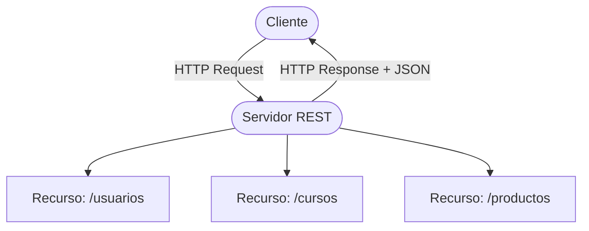

# ¿Qué es REST?

## Arquitectura REST

REST (Representational State Transfer) es un estilo de arquitectura para servicios web. Define cómo los sistemas se comunican a través de HTTP usando recursos identificados por URLs y verbos estándar.



## Principios fundamentales de REST

- `Recursos` — Todo se representa como un recurso identificado por una URL. Ejemplos: `/usuarios`, `/cursos/{id}`.
- `Verbos HTTP` — La acción se define por el método HTTP (GET, POST, PUT, DELETE).
- `Stateless` — El servidor no guarda estado entre peticiones. Cada request debe ser autocontenido.
- `Representación uniforme` — Los recursos se representan en un formato estándar, generalmente JSON.
- `Idempotencia` — GET, PUT y DELETE son idempotentes: ejecutarlos varias veces produce el mismo resultado. POST no lo es.

## REST vs RESTful

`REST` es el conjunto de principios arquitectónicos.
`RESTful` es un servicio que implementa esos principios correctamente.

```svg
<svg xmlns="http://www.w3.org/2000/svg" width="520" height="110" font-family="Roboto, Arial, sans-serif" font-size="13">
  <rect x="10" y="20" width="220" height="70" rx="8" fill="#1e2a3a" stroke="#42A5F5" stroke-width="1.5"/>
  <text x="120" y="48" text-anchor="middle" fill="#42A5F5" font-size="14" font-weight="bold">REST</text>
  <text x="120" y="68" text-anchor="middle" fill="#ccc">Estilo arquitectónico</text>
  <text x="120" y="84" text-anchor="middle" fill="#aaa">Conjunto de principios</text>

  <rect x="290" y="20" width="220" height="70" rx="8" fill="#1e2a3a" stroke="#66BB6A" stroke-width="1.5"/>
  <text x="400" y="48" text-anchor="middle" fill="#66BB6A" font-size="14" font-weight="bold">RESTful</text>
  <text x="400" y="68" text-anchor="middle" fill="#ccc">Implementación práctica</text>
  <text x="400" y="84" text-anchor="middle" fill="#aaa">Servicio que cumple REST</text>
</svg>
```

## Semántica REST: diseño de endpoints

Al diseñar endpoints siga estas convenciones:

- Use sustantivos en plural para los recursos: `/usuarios`, `/cursos`, `/productos`.
- Nunca use verbos en la URL. El verbo ya lo define el método HTTP.
- Anide recursos cuando tenga sentido: `/cursos/{id}/estudiantes`.

```svg
<svg xmlns="http://www.w3.org/2000/svg" width="520" height="260" font-family="Roboto, monospace" font-size="13">
  <rect x="10" y="10" width="500" height="240" rx="8" fill="#1a1f2e"/>
  <text x="30" y="38" fill="#aaa" font-size="12">MÉTODO</text>
  <text x="140" y="38" fill="#aaa" font-size="12">URL</text>
  <text x="330" y="38" fill="#aaa" font-size="12">ACCIÓN</text>
  <line x1="20" y1="45" x2="500" y2="45" stroke="#333" stroke-width="1"/>
  <text x="30" y="68" fill="#66BB6A" font-weight="bold">GET</text>
  <text x="140" y="68" fill="#42A5F5">/usuarios</text>
  <text x="330" y="68" fill="#ddd">Obtener todos</text>
  <text x="30" y="98" fill="#66BB6A" font-weight="bold">GET</text>
  <text x="140" y="98" fill="#42A5F5">/usuarios/{id}</text>
  <text x="330" y="98" fill="#ddd">Obtener uno</text>
  <text x="30" y="128" fill="#FFA726" font-weight="bold">POST</text>
  <text x="140" y="128" fill="#42A5F5">/usuarios</text>
  <text x="330" y="128" fill="#ddd">Crear nuevo</text>
  <text x="30" y="158" fill="#AB47BC" font-weight="bold">PUT</text>
  <text x="140" y="158" fill="#42A5F5">/usuarios/{id}</text>
  <text x="330" y="158" fill="#ddd">Reemplazar completo</text>
  <text x="30" y="188" fill="#AB47BC" font-weight="bold">PATCH</text>
  <text x="140" y="188" fill="#42A5F5">/usuarios/{id}</text>
  <text x="330" y="188" fill="#ddd">Actualizar parcial</text>
  <text x="30" y="218" fill="#ef5350" font-weight="bold">DELETE</text>
  <text x="140" y="218" fill="#42A5F5">/usuarios/{id}</text>
  <text x="330" y="218" fill="#ddd">Eliminar</text>
</svg>
```

Ejemplos de URLs incorrectas vs correctas:

```http
❌ GET /getUsuarios
❌ POST /createProducto
❌ DELETE /deleteUsuarioById
✅ GET /usuarios
✅ POST /productos
✅ DELETE /usuarios/{id}
```
