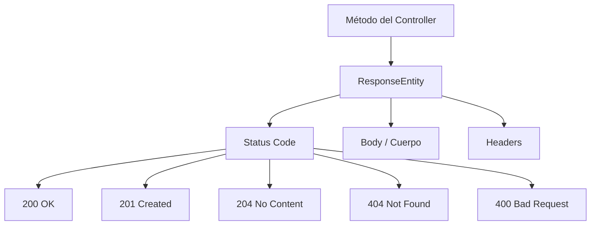

# RestControllers y HTTP Mappings

## @RestController

`@RestController` marca una clase como controlador REST. Combina `@Controller` + `@ResponseBody`, lo que significa que cada método retorna datos directamente serializados como JSON, sin pasar por una vista.

```java
@RestController
@RequestMapping("/usuarios")
public class UsuarioController {
    // todos los métodos aquí responden con JSON
}
```

## @RequestMapping

`@RequestMapping` define el prefijo de URL base para todos los endpoints del controlador.

```java
@RestController
@RequestMapping("/api/v1/usuarios")
public class UsuarioController {

    @RequestMapping(value = "/{id}", method = RequestMethod.GET)
    public Usuario getById(@PathVariable Long id) {
        return usuarioService.findById(id);
    }
}
```

En la práctica, en lugar de `method = RequestMethod.GET` se usan las anotaciones específicas por verbo HTTP.

## Mappings por verbo HTTP

Spring provee una anotación específica para cada verbo HTTP:

- `@GetMapping` — Consultar recursos (lectura, no modifica estado).
- `@PostMapping` — Crear un nuevo recurso.
- `@PutMapping` — Reemplazar un recurso completo.
- `@PatchMapping` — Actualizar parcialmente un recurso.
- `@DeleteMapping` — Eliminar un recurso.

```java
@RestController
@RequestMapping("/usuarios")
public class UsuarioController {

    @GetMapping
    public List<UsuarioDTO> getAll() {
        return usuarioService.findAll();
    }

    @GetMapping("/{id}")
    public UsuarioDTO getById(@PathVariable Long id) {
        return usuarioService.findById(id);
    }

    @PostMapping
    public UsuarioDTO create(@RequestBody UsuarioDTO dto) {
        return usuarioService.save(dto);
    }

    @PutMapping("/{id}")
    public UsuarioDTO update(@PathVariable Long id, @RequestBody UsuarioDTO dto) {
        return usuarioService.update(id, dto);
    }

    @DeleteMapping("/{id}")
    public void delete(@PathVariable Long id) {
        usuarioService.delete(id);
    }
}
```

## ResponseEntity

`ResponseEntity<T>` permite controlar completamente la respuesta HTTP: el cuerpo, el código de estado y los headers. Es la forma recomendada de responder en un controlador REST.



Formas de construir una `ResponseEntity`:

```java
// Con el builder (recomendado)
ResponseEntity.ok(body);                              // 200 OK con cuerpo
ResponseEntity.status(HttpStatus.CREATED).body(dto);  // 201 Created con cuerpo
ResponseEntity.noContent().build();                   // 204 No Content sin cuerpo
ResponseEntity.notFound().build();                    // 404 Not Found sin cuerpo
ResponseEntity.badRequest().build();                  // 400 Bad Request sin cuerpo

// Con código numérico
ResponseEntity.status(201).body(dto);
ResponseEntity.status(404).build();
```

## HTTPStatus

Spring provee la clase `HttpStatus` con constantes para todos los códigos HTTP estándar.

```svg
<svg xmlns="http://www.w3.org/2000/svg" width="520" height="290" font-family="Roboto, Arial, sans-serif" font-size="13">
  <rect x="10" y="10" width="500" height="270" rx="8" fill="#1a1f2e"/>
  <text x="30" y="38" fill="#aaa" font-size="12">CÓDIGO</text>
  <text x="130" y="38" fill="#aaa" font-size="12">HttpStatus</text>
  <text x="290" y="38" fill="#aaa" font-size="12">CUÁNDO USARLO</text>
  <line x1="20" y1="45" x2="500" y2="45" stroke="#333" stroke-width="1"/>
  <text x="30" y="70" fill="#66BB6A" font-weight="bold">200</text>
  <text x="130" y="70" fill="#42A5F5">OK</text>
  <text x="290" y="70" fill="#ddd">GET, PUT, PATCH exitosos</text>
  <text x="30" y="100" fill="#66BB6A" font-weight="bold">201</text>
  <text x="130" y="100" fill="#42A5F5">CREATED</text>
  <text x="290" y="100" fill="#ddd">POST que crea un recurso</text>
  <text x="30" y="130" fill="#66BB6A" font-weight="bold">204</text>
  <text x="130" y="130" fill="#42A5F5">NO_CONTENT</text>
  <text x="290" y="130" fill="#ddd">DELETE exitoso, sin cuerpo</text>
  <text x="30" y="160" fill="#FFA726" font-weight="bold">400</text>
  <text x="130" y="160" fill="#42A5F5">BAD_REQUEST</text>
  <text x="290" y="160" fill="#ddd">Datos inválidos del cliente</text>
  <text x="30" y="190" fill="#FFA726" font-weight="bold">401</text>
  <text x="130" y="190" fill="#42A5F5">UNAUTHORIZED</text>
  <text x="290" y="190" fill="#ddd">No autenticado</text>
  <text x="30" y="220" fill="#ef5350" font-weight="bold">403</text>
  <text x="130" y="220" fill="#42A5F5">FORBIDDEN</text>
  <text x="290" y="220" fill="#ddd">Sin permisos</text>
  <text x="30" y="250" fill="#ef5350" font-weight="bold">404</text>
  <text x="130" y="250" fill="#42A5F5">NOT_FOUND</text>
  <text x="290" y="250" fill="#ddd">Recurso no existe</text>
</svg>
```

## CRUD completo con ResponseEntity

Así queda un controller completo usando `ResponseEntity` con los códigos correctos en cada operación:

```java
@RestController
@RequestMapping("/usuarios")
public class UsuarioController {

    @Autowired
    private UsuarioService usuarioService;

    @GetMapping
    public ResponseEntity<List<UsuarioDTO>> getAll() {
        return ResponseEntity.ok(usuarioService.findAll());         // 200
    }

    @GetMapping("/{id}")
    public ResponseEntity<UsuarioDTO> getById(@PathVariable Long id) {
        UsuarioDTO dto = usuarioService.findById(id);
        if (dto == null) {
            return ResponseEntity.notFound().build();               // 404
        }
        return ResponseEntity.ok(dto);                             // 200
    }

    @PostMapping
    public ResponseEntity<UsuarioDTO> create(@RequestBody UsuarioDTO dto) {
        UsuarioDTO created = usuarioService.save(dto);
        return ResponseEntity.status(HttpStatus.CREATED).body(created); // 201
    }

    @PutMapping("/{id}")
    public ResponseEntity<UsuarioDTO> update(
        @PathVariable Long id,
        @RequestBody UsuarioDTO dto
    ) {
        return ResponseEntity.ok(usuarioService.update(id, dto));  // 200
    }

    @DeleteMapping("/{id}")
    public ResponseEntity<Void> delete(@PathVariable Long id) {
        usuarioService.delete(id);
        return ResponseEntity.noContent().build();                 // 204
    }
}
```
