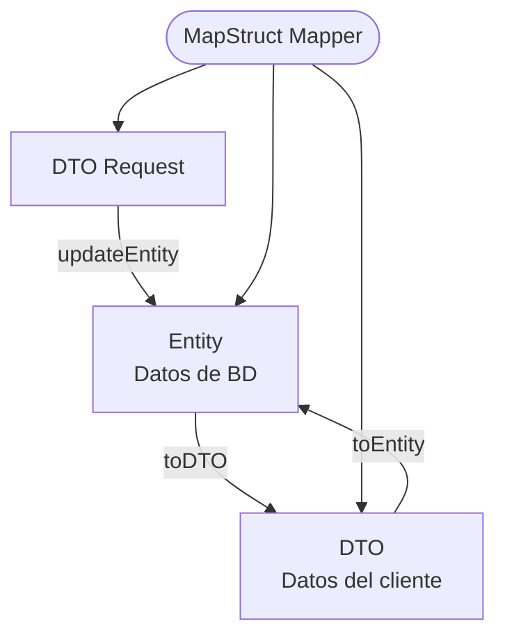

# MapStruct

MapStruct es una librería de Java que genera automáticamente el código de conversión entre objetos, como entidades y DTOs. Elimina el código repetitivo de mapeo manual.



## ¿Por qué MapStruct?

Sin MapStruct, el mapeo manual es tedioso y propenso a errores:

```java
// Sin MapStruct — manual y repetitivo
public UsuarioDTO toDTO(Usuario entity) {
    UsuarioDTO dto = new UsuarioDTO();
    dto.setId(entity.getId());
    dto.setNombre(entity.getNombre());
    dto.setEmail(entity.getEmail());
    // ...un campo más y hay que recordar agregarlo aquí
    return dto;
}
```

Con MapStruct, el compilador genera ese código automáticamente a partir de una interfaz.

## Instalación

Agregue las dependencias y el plugin al `pom.xml`:

```xml
<!-- Variable de versión -->
<properties>
    <mapstruct.version>1.6.3</mapstruct.version>
</properties>

<!-- Dependencias -->
<dependency>
    <groupId>org.mapstruct</groupId>
    <artifactId>mapstruct</artifactId>
    <version>${mapstruct.version}</version>
</dependency>

<dependency>
    <groupId>org.mapstruct</groupId>
    <artifactId>mapstruct-processor</artifactId>
    <version>${mapstruct.version}</version>
    <scope>provided</scope>
</dependency>
```

Agregue el plugin de compilación para que el procesador de anotaciones funcione correctamente:

```xml
<plugin>
    <groupId>org.apache.maven.plugins</groupId>
    <artifactId>maven-compiler-plugin</artifactId>
    <version>3.8.1</version>
    <configuration>
        <source>${java.version}</source>
        <target>${java.version}</target>
        <annotationProcessorPaths>
            <path>
                <groupId>org.mapstruct</groupId>
                <artifactId>mapstruct-processor</artifactId>
                <version>${mapstruct.version}</version>
            </path>
        </annotationProcessorPaths>
    </configuration>
</plugin>
```

Verifique que el procesador genera el código correctamente:

```bash
mvn compile
```

Después de compilar, el código generado aparece en `target/generated-sources/annotations/`. Si algo falla, ese directorio muestra exactamente qué mapper no pudo generarse.

## Mapping simple

Suponga que tiene una entidad `Curso` y quiere un DTO que exponga solo algunos campos:

```java
// Entidad de base de datos
@Entity
public class Curso {
    @Id
    private Long id;
    private String nombre;

    @ManyToOne
    private Profesor profesor;
    // getters y setters
}

// DTO que expone al cliente
public class CursoDTO {
    private Long id;
    private String nombre;
    private Long profesorId; // solo el ID del profesor
    // getters y setters
}
```

El mapper declara los métodos de conversión. MapStruct genera la implementación en tiempo de compilación:

```java
import org.mapstruct.Mapper;
import org.mapstruct.Mapping;
import org.mapstruct.MappingTarget;

@Mapper(componentModel = "spring")
public interface CursoMapper {

    // Entity → DTO
    @Mapping(source = "profesor.id", target = "profesorId")
    CursoDTO toDTO(Curso curso);

    // DTO → Entity
    @Mapping(source = "profesorId", target = "profesor.id")
    Curso toEntity(CursoDTO dto);

    // Actualiza los campos de un entity existente sin crear uno nuevo
    @Mapping(source = "profesorId", target = "profesor.id")
    void updateEntityFromDTO(CursoDTO dto, @MappingTarget Curso entity);
}
```

El atributo `componentModel = "spring"` hace que el mapper sea un bean de Spring, lo que permite inyectarlo con `@Autowired`.

En `@Mapping`, `source` es la ruta del objeto de entrada y `target` la del objeto de salida. La notación con punto (`profesor.id`) permite acceder a atributos anidados.

## Usar el Mapper en el Service

Inyecte el mapper en el servicio y úselo para convertir entre entidad y DTO:

```java
@Service
public class CursoServiceImpl implements CursoService {

    @Autowired
    private CursoMapper cursoMapper;

    @Autowired
    private CursoRepository cursoRepository;

    @Override
    public List<CursoDTO> findAll() {
        return cursoRepository.findAll()
            .stream()
            .map(cursoMapper::toDTO)
            .toList();
    }

    @Override
    public CursoDTO findById(Long id) {
        Curso curso = cursoRepository.findById(id).orElse(null);
        if (curso == null) return null;
        return cursoMapper.toDTO(curso);
    }

    @Override
    public CursoDTO save(CursoDTO dto) {
        Curso entity = cursoMapper.toEntity(dto);
        Curso saved = cursoRepository.save(entity);
        return cursoMapper.toDTO(saved);
    }

    @Override
    public CursoDTO update(Long id, CursoDTO dto) {
        Curso entity = cursoRepository.findById(id).orElseThrow();
        cursoMapper.updateEntityFromDTO(dto, entity);
        return cursoMapper.toDTO(cursoRepository.save(entity));
    }
}
```

## DTOs anidados

Si en lugar de solo el ID del profesor quiere el DTO completo del profesor dentro del DTO de curso, necesita un mapper por cada tipo involucrado:

```java
// DTOs
public class CursoDTO {
    private Long id;
    private String nombre;
    private ProfesorDTO profesor; // DTO anidado
}

public class ProfesorDTO {
    private Long id;
    private String nombre;
    private String email;
}
```

Primero cree el mapper del tipo anidado:

```java
@Mapper(componentModel = "spring")
public interface ProfesorMapper {
    ProfesorDTO toDTO(Profesor profesor);
    Profesor toEntity(ProfesorDTO dto);
    void updateEntityFromDTO(ProfesorDTO dto, @MappingTarget Profesor entity);
}
```

Luego referencie ese mapper desde el mapper principal con `uses`:

```java
@Mapper(componentModel = "spring", uses = ProfesorMapper.class)
public interface CursoMapper {

    // MapStruct detecta automáticamente que Profesor → ProfesorDTO
    // y usa ProfesorMapper para esa conversión
    CursoDTO toDTO(Curso curso);

    Curso toEntity(CursoDTO dto);

    void updateEntityFromDTO(CursoDTO dto, @MappingTarget Curso entity);
}
```

Con `uses = ProfesorMapper.class`, MapStruct sabe que cuando necesite convertir `Profesor` ↔ `ProfesorDTO` debe delegar al `ProfesorMapper`.

## Controller con DTOs y ResponseEntity

Con DTOs y el mapper configurados, el controller queda limpio y solo se ocupa del HTTP:

```java
@RestController
@RequestMapping("/cursos")
public class CursoController {

    @Autowired
    private CursoService cursoService;

    @GetMapping
    public ResponseEntity<List<CursoDTO>> getAll() {
        return ResponseEntity.ok(cursoService.findAll());
    }

    @GetMapping("/{id}")
    public ResponseEntity<CursoDTO> getById(@PathVariable Long id) {
        CursoDTO dto = cursoService.findById(id);
        if (dto == null) {
            return ResponseEntity.notFound().build();
        }
        return ResponseEntity.ok(dto);
    }

    @PostMapping
    public ResponseEntity<CursoDTO> create(@RequestBody CursoDTO dto) {
        return ResponseEntity.status(HttpStatus.CREATED).body(cursoService.save(dto));
    }

    @PutMapping("/{id}")
    public ResponseEntity<CursoDTO> update(@PathVariable Long id, @RequestBody CursoDTO dto) {
        return ResponseEntity.ok(cursoService.update(id, dto));
    }

    @DeleteMapping("/{id}")
    public ResponseEntity<Void> delete(@PathVariable Long id) {
        cursoService.delete(id);
        return ResponseEntity.noContent().build();
    }
}
```

## GYM de REST

Implemente los siguientes endpoints para el proyecto del curso. Recuerde usar semántica REST correcta.

- Obtener todos los cursos con su respectivo profesor. Paginados.
- Obtener un curso por `id` con su profesor y su lista de estudiantes.
- Buscar cursos por coincidencias en el nombre. Paginados.
- Obtener todos los estudiantes inscritos en un curso específico.
- Consultar todos los cursos de un estudiante por su código.
- Buscar estudiantes por programa académico, ordenados por código. Paginados.
- Listar todos los cursos con la cantidad de estudiantes inscritos.
- Crear un nuevo curso y asignarle un profesor existente.
- Registrar un nuevo estudiante.
- Matricular un estudiante en un curso.
- Actualizar nombre, código o programa de un estudiante.
- Eliminar una matrícula por `id`.

```plain
https://classroom.github.com/a/tFfCV0KZ
```

Entregue esta tarea a más tardar el jueves de semana 13.
